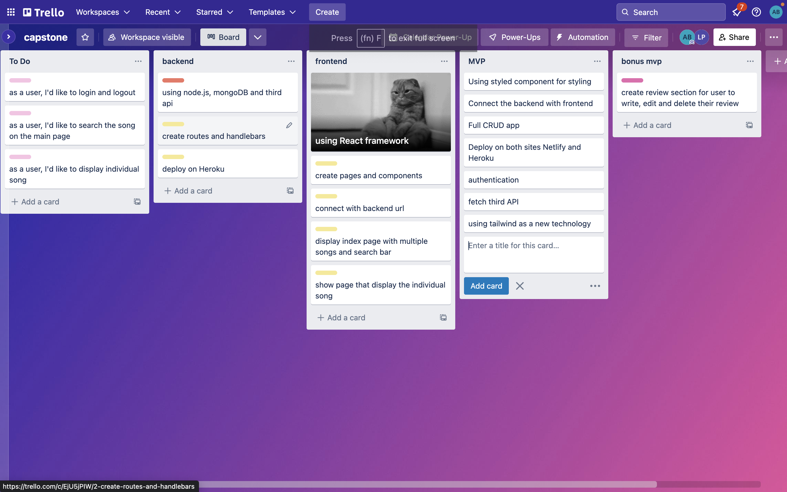
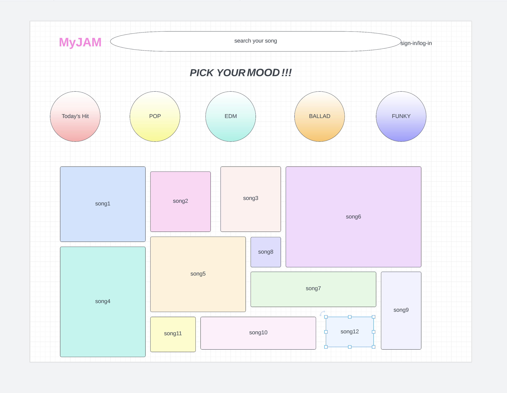
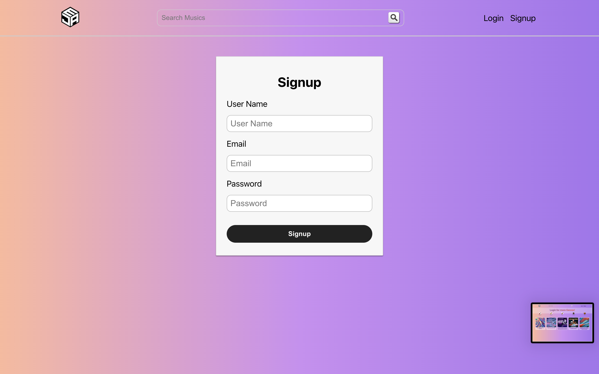
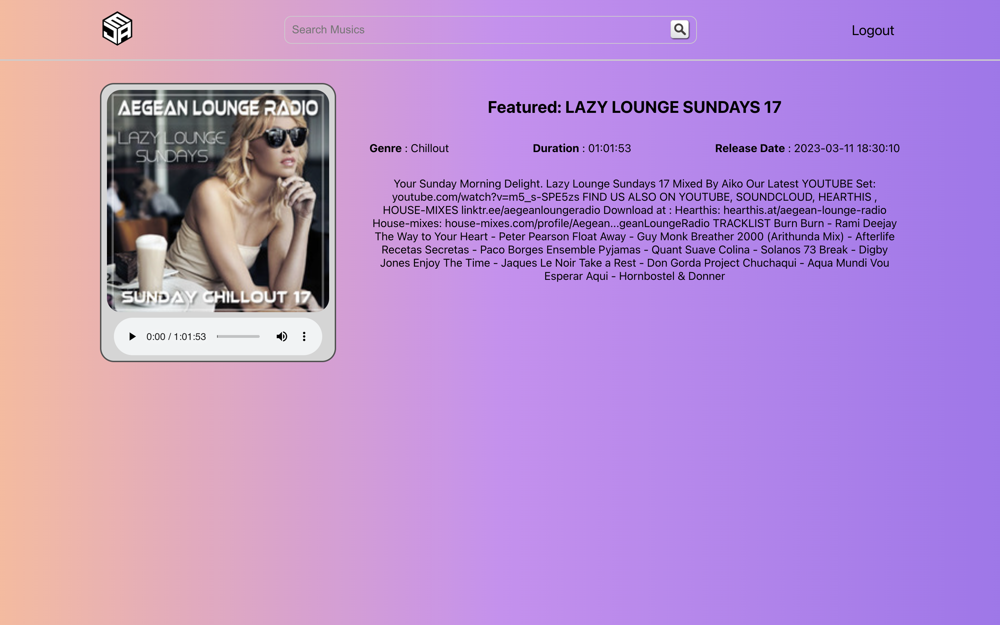

# myJAM app

this is an app to provide user music list/songs in several genres

## Repo
#### Frontend: [https://github.com/anbee123/myJAM-frontend-.git](https://github.com/anbee123/myJAM-frontend-.git)
#### Backend: [https://github.com/anbee123/myJAM-backend.git](https://github.com/anbee123/myJAM-backend.git)

### Trello

### Wireframe

### Interfaces

### Technologies Used

* Express
* React
* Tailwind 
* Rest API
* MongoDB/Mongoose
* Node
* JWT/Full CRUD

## Live link

[https://welcometomyjam.netlify.app/](https://welcometomyjam.netlify.app/)